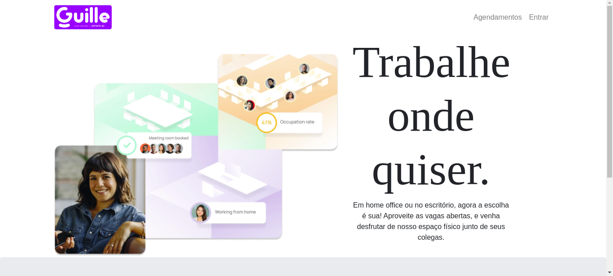
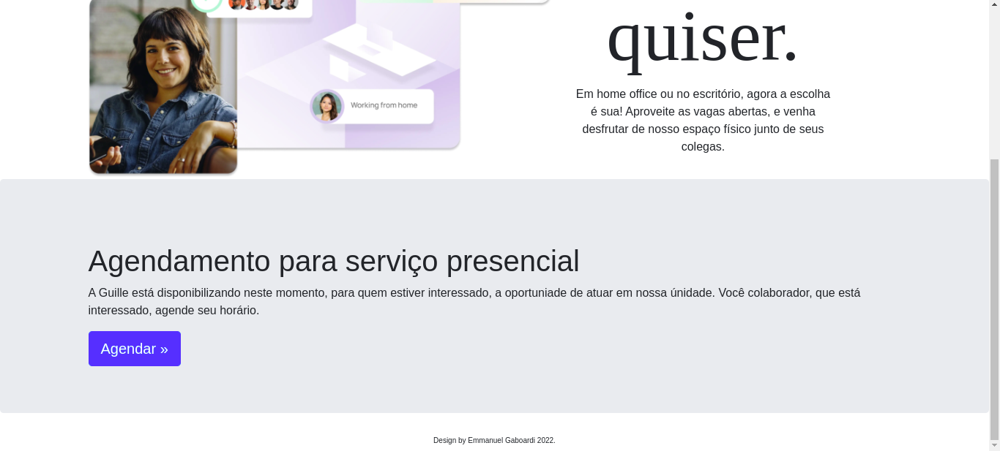
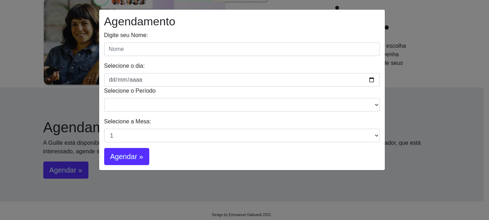
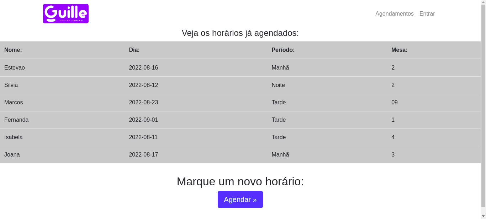
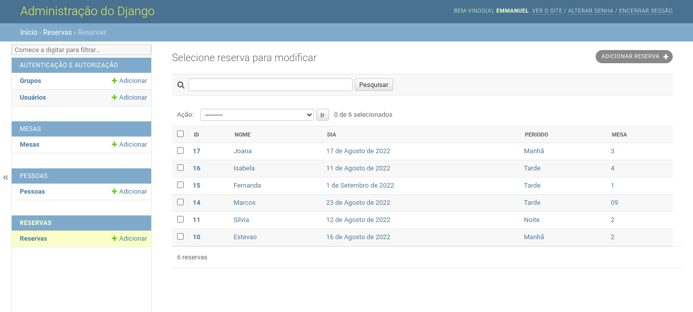
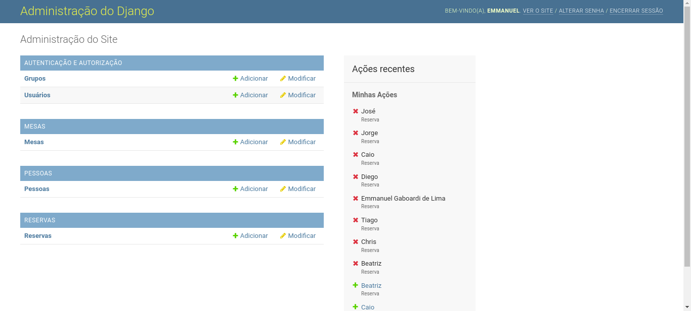
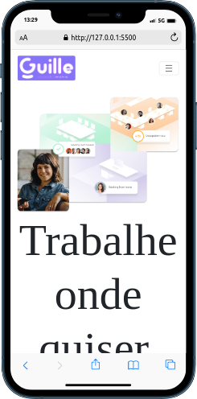
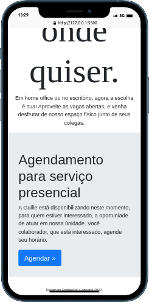
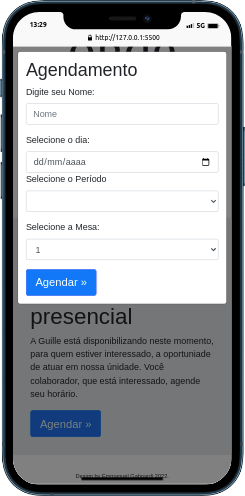
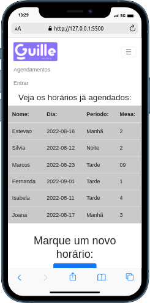

<h1 align="center">DESAFIO PRÁTICO LOEFFA</h1>
<h4>Este projeto, consiste em um <strong>APP</strong> para criação de reservas de ambientes de trabalho, presencial em uma empresa. Onde o funcionário consegue agendar, e conferir as reservas ja feitas dentro do mesmo aplicativo.</h4>

 
<h4><strong>Abaixo temos mais informações sobre sua criação e funcionamento:</strong></h4>
   
<h2 align="center">🛠️ Teve seu desenvolvimento feito em duas etapas:</h2>

<h2> 💻 FRONT-END</h2>

Dentro do front-end, fiz o seu desenvlvimento utilizando <strong> HTML,  CSS,  JAVASRIPT</strong> aproveitando dos recursos do framework <strong>BOOTSTRAP</strong> para toda a criação do layout da página.

Como hoje em dia as aplicações web devem ser pensadas tanto para o uso em computadores quanto no mobile, este app, tem recursos de responsividade, adequando-se as dimensões de tela do  aparelho que está consumindo seu conteúdo.

 <h2>📁 BACK-END</h2>  
 
A criação do back-end foi toda feita em django um framework de python, que para mim foi um grade desafio, pois nao tinha utilizado-o ainda.

 
Temos presente no back-end, em primeiro lugar um painel administrativo que nos possibilita ver as aplicações diretamente em sua interface gráfica.

 
Em segundo ponto temos armazenadas as APi para consumo do front-end, possibilitando esta comunicação entre armazenamento e envio das informações nele guardadas.

  
<h2 align="center">🛠️ Rodando o projeto:</h2>

 - Baixando este projeto, verá que temos duas pastas. Uma com o front-end e outra contendo o back-end.Abra as pastas separadamente em seu editor.

 - Para que o BACK-END funcione o primeiro passo sera ativar o venv, e baixar todas as dependências instaladas no arquivo: requirements.txt 

 - Feito a intalação abra o servidor local, e para acessar o admin, use: emmanuel/ senha:123456

 - Abra a index.html do front-end e o projeto ja estará rodando.

<h2 align="center"> 🧑🏻‍💻 Visão Geral do App</h2>

<h4>Vamos ver como se apresenta nosso site em cada dispositivo?</h4>

Computador:

Celulares:

 

<h1>OBSERVAÇÕES</h1>

Tive alguns problemas para conseguir trazer a api de mesas cadastradas, e para não perder o prazo deixei este intem sem ser feito

